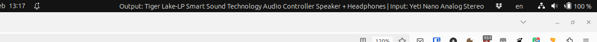

# Arvid's Sound Status

Extension for GNOME Shell 44 that adds a button to the status area
containing the current PulseAudio default sink (output) and source
(input) in the system menu:

Clicking the button opens the sound settings.

